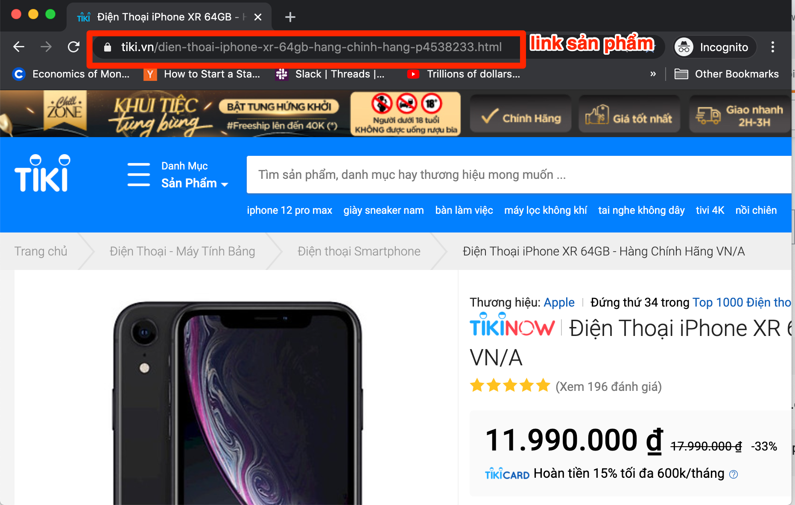
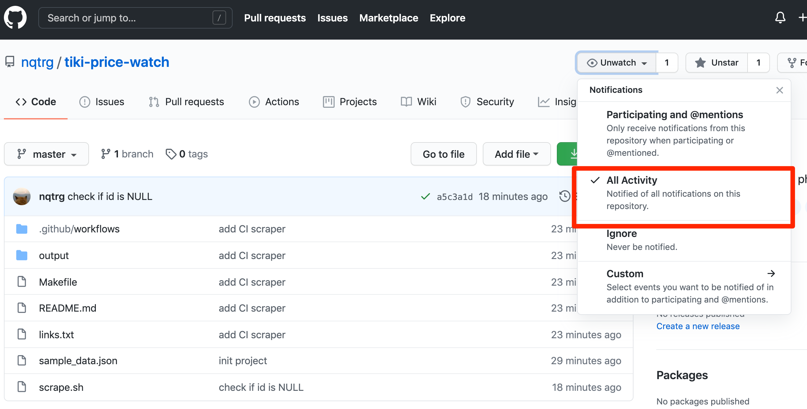

# Theo dõi giá sản phẩm TIKI

Theo dõi biến động giá sản phẩm TIKI sử dụng [Github Actions](https://github.com/features/actions). Mỗi giờ, sẽ có 1 cron job được trigger và kiểm tra giá tại thời điểm đó. Nếu giá cả thay đổi, Github Actions sẽ tạo ra 1 commit và gửi thông báo đến email cho bạn.

Thông báo có dạng như sau:
```
Latest data: Sat Jan 23 18:10:59 UTC 2021
diff --git a/output/4538233.txt b/output/4538233.txt
index c4959d8..2517d55 100644
--- a/output/4538233.txt
+++ b/output/4538233.txt
@@ -1,2 +1,2 @@
-11490000
+11990000
 Link sản phẩm: https://tiki.vn/dien-thoai-iphone-xr-64gb-hang-chinh-hang-p4538233.html
```
Vậy nghĩa là sản phẩm vừa thay đổi giá từ `11490000` sang `11990000`.

## Ưu điểm
- Không phải set up server
- Miễn phí hoàn toàn
- Tự quản lí, không cần dùng dịch vụ của bên thứ 3

## Cách sử dụng
1. Fork this project to your own repo.
1. Copy link sản phẩm và dán vào file [links.txt](https://github.com/nqtrg/tiki-price-watch/blob/master/links.txt). Mỗi sản phẩm một dòng.
    
1. Kiểm tra lại script scrape có chạy được với danh sách links không:
    ```bash
    make test
    ```
2. Commit and push
3. Đăng ký nhận thông báo của repo: Settings -> Notifications -> Thêm email nhận thông báo khi có commit mới.
    

Mỗi khi giá cả thay đổi, Github Action sẽ tạo ra 1 commit mới. Bạn sẽ nhận được thông báo về email đã đăng ký.

## Credit
I was inspired by this [work](https://github.com/simonw/ca-fires-history).
